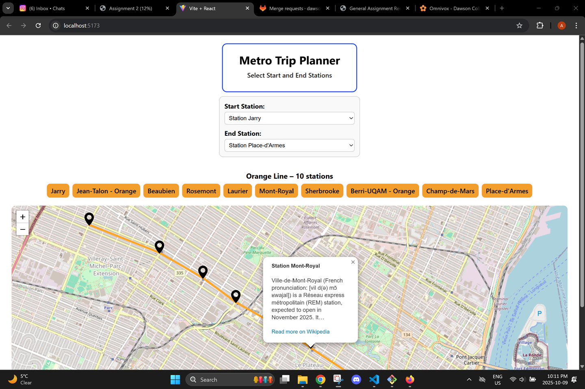

# Metro Trip Planner (Andy Ionita)

This web application helps users plan metro trips by selecting start and end stations.  
It displays all stations between them on the line. It shows markers on a map and even provides Wikipedia info for each station. 

---

## Screenshot

- **App**
  - Provides the overall page layout (title, header, and main content)
  - Renders Header and `MapExample

- **Header**
  - Displays the app title and subtitle
  - Serves as a consistent top banner for the app layout

- **MapExample**
  - Handles the main metro trip planning logic and UI:
    - Fetches station data from the Express API
    - Manages state for selected start/end stations
    - Displays dropdown menus for selection
    - Renders StationChips and the MetroMarkers map

- **StationChips**
  - Displays the line name and a horizontal list of stations between start and end
  - Visually represents the metro line segment with color-coded chips

- **MetroMarkers**
  - Displays metro stations as map markers and draws a polyline connecting them
  - Contains the WikiSummary popup for each marker

- **WikiSummary**
  - Fetches and caches a short description of each station from the Wikipedia API
  - Displays the name, summary text, and a “Read more on Wikipedia” link

## Requirements

- **Start and End Stations**
    - Choosing a start station and an end station shows all stations between them on the same line
    - End station choices are limited to stations on the same line as the start

- **Map Interactions**
    - Metro stations are displayed as map markers
    - Clicking a marker highlights the station and fetches info from the Wikipedia API
    - Popup shows station details

- **Station Data**
    - Uses STM geojson file as data source
    - Server reads the file once and caches it in memory
    - Data only includes relevant metro lines
    - On server start: read the file and if successful, server starts listening

- **React UI**
    - Dropdown forms to select start and end stations.
    - Map component with markers, lines, and popups.
    - When form data changes, then update map and re-read updated data.
    - UI must be usable on both desktop and mobile.

- **Server Responsibilities**
    - Express server reads STM station data once before handling requests.
    - Provides REST API routes to get all stations
    - Serves static routes that include the React components

- **Client Responsibilities**
  - React app fetches from Express AP
  - React components communicate with props and state.
  - Wikipedia API used to show basic station info.
  - Must update map and data dynamically when form changes.

---

## Additional information

    - Select start + end stations will make the user see all stations in between on the map.  
    - Clicking markers will show station info from Wikipedia.  
    - System reads STM data once at startup so that it's fast and efficient.  
    - Works on both mobile and desktop.  
    - Express server and React UI run together on the same origin.  

---

## APIs and Data

- STM GeoJSON file will provide station and line data 
- Wikipedia API will be used to fetch descriptions of metro stations
- ReactiveUI will be used for state, navigation and UI handling

---

## Attributions

This project uses data and libraries from the following sources:

- **STM (Société de transport de Montréal)** — GeoJSON data for Montréal metro stations provided through the STM open data portal.
- **Leaflet** — Open-source JavaScript library for interactive maps.  
  [Leaflet documentation](https://leafletjs.com/)
- **React Leaflet** — React wrapper for Leaflet components, used to render the map, markers, and polylines. 
  [React Leaflet documentation](https://react-leaflet.js.org/)
- **Wikipedia API** — Used to fetch short summaries about each Montreal metro station
- **OpenStreetMap** — Map tiles and geographic data displayed in the app  
  [© OpenStreetMap contributors](https://www.openstreetmap.org/copyright)
- **Marker Icon** — Default Leaflet marker icon image given with the Leaflet package